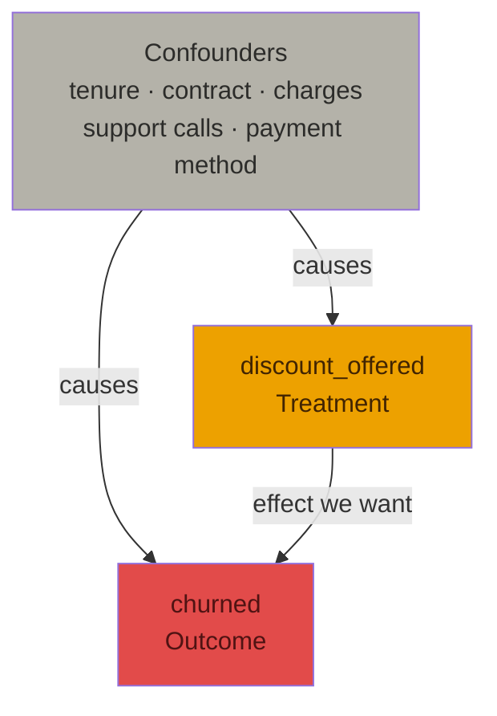
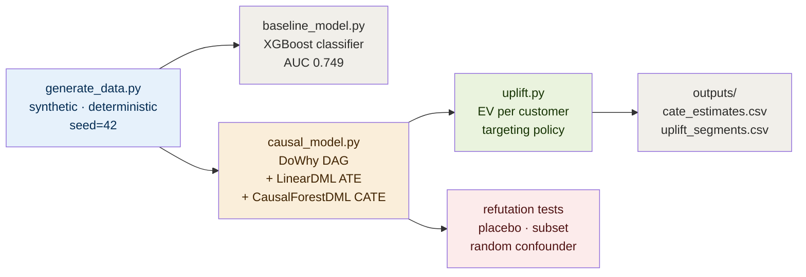
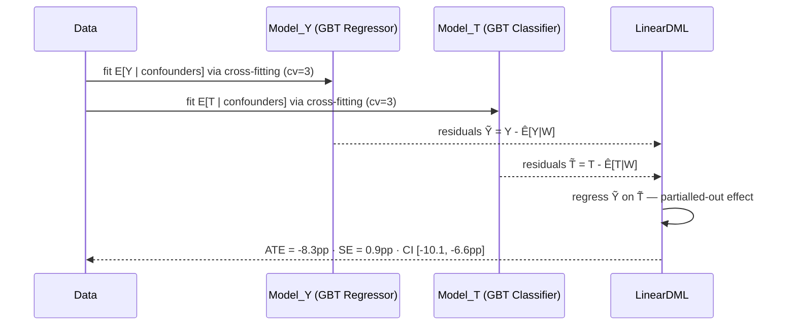

# Customer Churn: Causal Intervention Targeting

[](https://github.com/kittsmc-hub/Customer_Churn_Causal/actions/workflows/ci.yml)
[](https://www.python.org/downloads/)
[](LICENSE)

Predicting who will churn is the solved half of the retention problem. This project answers the harder half: **does offering a customer a discount coupon actually change whether they leave, and for whom does that spend make financial sense?**

That is a causal question. A predictive model — no matter how accurate — cannot answer it. This project demonstrates why, then shows the tooling (DoWhy + EconML) that can.

---

## The core problem

A churn classifier trained on observational data learns that customers who received discounts are high-churn-risk — because retention reps already preferentially target high-risk accounts. That correlation runs backwards from what you need. Use the model's risk score to pick discount targets and you waste budget on accounts that would have churned regardless, and miss the customers a timely discount could actually save.

| Method | Effect estimate | Interpretation |
|---|---|---|
| Naive (treated vs untreated churn rate) | **-4.8pp** | Biased — confounded by rep targeting behavior |
| DoWhy + EconML LinearDML (ATE) | **-8.3pp** (95% CI [-10.1, -6.6pp]) | Causal, confounding-adjusted |

The 3.5pp gap is the cost of using a predictive model as a targeting tool.

---

## Architecture

### Causal DAG

The structural assumption driving the entire estimation strategy, stated explicitly rather than inferred:



Reps observe the same confounder signals (tenure, contract type, support call volume) when deciding who to offer discounts, creating a direct path `confounders → treatment` that biases naive comparison. DoWhy's backdoor criterion identifies this set as the adjustment needed to isolate the causal effect of treatment on outcome.

### Pipeline



### Double ML estimation (LinearDML)



Cross-fitting (fitting nuisance models on held-out folds) prevents the nuisance models from memorizing the training data and biasing the treatment effect estimate.

---

## Results at a glance

### Predictive model (baseline)

| Metric | Value | Notes |
|---|---|---|
| ROC AUC | **0.749** | Trained on 7,500 · evaluated on 2,500 |
| Average precision | 0.698 | Precision-recall summary |
| Brier score | 0.202 | Lower is better; 0.25 = coin flip |
| Training time | 0.31s | XGBoost, 300 estimators, n_jobs=-1 |
| Peak memory | 7.2 MB | |

High AUC. High accuracy. Zero causal validity for intervention decisions.

### Causal estimation

| Metric | Value | Notes |
|---|---|---|
| ATE (LinearDML) | **-8.35pp** | True ATE: -8.41pp — error of 0.06pp |
| 95% CI | [-10.13, -6.56pp] | Analytic inference (HC0) |
| Standard error | 0.91pp | |
| Fit time (ATE) | 4.5s | 3-fold cross-fitting, HistGBT nuisance models |
| Fit time (CATE) | 10.3s | CausalForestDML, 400 trees |
| CATE Spearman ρ vs ground truth | **0.241** | p < 10⁻¹³² — significant ranking signal |
| CATE p5 / p95 | -21.4pp / -2.0pp | Range of per-customer effects |
| Peak memory (CATE) | 21.8 MB | |

### Uplift targeting

| Segment | Customers | Share | Mean CATE | Mean EV/customer | Action |
|---|---|---|---|---|---|
| Persuadable | 4,207 | 42.1% | -13.3pp | **+$20.78** | Offer discount |
| Lost cause | 5,742 | 57.4% | -4.9pp | **-$1.72** | Withhold |
| Sleeping dog | 51 | 0.5% | +0.6pp | **-$16.73** | Withhold (discount backfires) |

### Policy ROI (10,000 customers · $15 coupon · $45/month · 6-month horizon)

| Policy | Expected value | vs naive |
|---|---|---|
| Naive — discount everyone | $76,677 | — |
| Targeted — discount EV-positive only | **$95,409** | **+$18,732 (+24.4%)** |

Break-even CATE: -5.6pp. Customers above this threshold get the discount withheld.

---

## Test suite

Two lanes with different budgets and purposes.

### Gate tests (deterministic · local · free)

Run on every commit via pre-commit hook. Zero model training.

```bash
python3 -m pytest tests/test_gate.py -v
# 12 passed in 0.31s
```

Covers: data generation determinism, schema validation, range constraints, confounding check (treatment rate must vary by contract type), expected-value formula correctness, segment classification boundaries, and policy ordering invariant.

### Periodic evals (model training · graded against ground truth)

Run before ship and nightly in CI. Trains real models. Each eval has a documented threshold and rationale.

```bash
python3 tests/eval_causal_quality.py
```

| Eval | Checks | Threshold | Last result |
|---|---|---|---|
| `baseline_model_has_predictive_signal` | XGBoost AUC | > 0.65 | ✓ 0.749 |
| `naive_comparison_is_biased` | Treated-untreated diff | > -0.06pp | ✓ -4.75pp |
| `causal_ate_recovers_true_effect` | `|estimated - true ATE|` | < 0.04pp | ✓ 0.006pp |
| `cate_ranks_persuadables_above_lost_causes` | Spearman ρ vs ground truth | > 0.20 | ✓ 0.241 |
| `targeted_policy_beats_naive_policy` | EV delta | > $5,000 | ✓ +$18,732 |

Ground truth is computable because the dataset is synthetic with a known, documented data-generating process. The same check is structurally impossible on real observational data.

---

## Setup

```bash
git clone https://github.com/kittsmc_hub/Customer_Churn_Causal.git
cd churn-causal
pip install -r requirements.txt
```

Requirements: Python 3.12+. No GPU needed. All fits run on CPU in under 15 seconds.

```
pandas>=2.0
numpy>=1.24
scikit-learn>=1.3
xgboost>=2.0
dowhy>=0.11
econml>=0.15
scipy>=1.10
pytest>=7.4
```

---

## Running the pipeline

Each script is independent and idempotent. Run them in order.

```bash
# 1. Generate data (deterministic, seed=42)
python3 data/generate_data.py
# Wrote 10000 rows to data/churn_data.csv
# Overall churn rate: 0.448 | Treatment rate: 0.557

# 2. Baseline classifier
python3 src/baseline_model.py
# AUC 0.749 | Average precision 0.698 | Brier 0.202

# 3. Causal model: ATE + refutations + CATE
python3 src/causal_model.py
# ATE: -8.35pp [95% CI -10.13, -6.56pp]
# Placebo PASS | Subset PASS | Random confounder PASS
# Wrote outputs/cate_estimates.csv

# 4. Uplift segmentation + ROI
python3 src/uplift.py
# Persuadable 42.1% | Lost cause 57.4% | Sleeping dog 0.5%
# Targeted beats naive by +$18,732
# Wrote outputs/uplift_segments.csv
```

Full pipeline end to end: **~16 seconds** on a single core.

---

## Project structure

```
churn-causal/
├── .github/workflows/ci.yml   # Gate tests: every push/PR
│                              # Evals: push to main + nightly
├── .gitignore                 # Excludes generated CSVs — reproducible from code
├── LICENSE                    # MIT
├── README.md
├── requirements.txt
│
├── data/
│   └── generate_data.py       # Synthetic dataset with documented confounding
│                              # and known heterogeneous treatment effect
│
├── src/
│   ├── baseline_model.py      # XGBoost classifier — the predictive ceiling
│   │                          # deliberately NOT used for targeting decisions
│   ├── causal_model.py        # DoWhy DAG · LinearDML ATE · CausalForestDML CATE
│   │                          # · 3 refutation tests
│   └── uplift.py              # CATE → expected value → targeting policy → ROI
│
├── tests/
│   ├── test_gate.py           # 12 deterministic tests · 0.31s · no model fitting
│   └── eval_causal_quality.py # 5 model-training evals · ~15s · graded vs ground truth
│
├── docs/
│   └── blog_post.md           # "Why your churn model doesn't actually help retention"
│
└── outputs/                   # Generated at runtime · gitignored
    ├── cate_estimates.csv      # Per-customer CATE from CausalForestDML
    └── uplift_segments.csv     # Segments + targeting recommendations + EV
```

---

## Design decisions and trade-offs

### Why synthetic data instead of the public IBM Telco dataset

The IBM/Kaggle Telco churn dataset has no treatment column and no randomization record. Without knowing how discounts were assigned, there is no ground truth to validate a CATE estimator against — a confidently wrong estimate looks identical to a correct one. The synthetic generator replicates the IBM dataset's feature distributions (tenure, contract type, charges, service type) and adds two things that make the causal problem evaluable: a documented confounded treatment assignment mechanism, and a known heterogeneous treatment effect. This is the trade-off: realism for external validity; evaluability for internal rigor.

### Why LinearDML for ATE instead of DoWhy's bootstrap CIs

DoWhy's `estimate_effect` with bootstrap confidence intervals refits the full nuisance models dozens of times. LinearDML provides fast analytic (HC0-based) inference at the same point estimate. Bootstrap is appropriate for small samples where asymptotic assumptions are shaky; at n=10,000 with well-behaved features, analytic inference is faster and equally valid. DoWhy is still used for identification (stating and checking the backdoor criterion) — just not for the inference step.

### Why CausalForestDML for CATE instead of a meta-learner (T-learner, S-learner, X-learner)

Meta-learners estimate CATE by training separate outcome models per treatment arm and subtracting their predictions. This is straightforward but has two known failure modes: outcome models fit the mean, not the treatment heterogeneity, and the subtraction amplifies variance. CausalForestDML inherits the DML orthogonalization (same nuisance model as the ATE step) and then uses a forest that splits specifically on treatment effect heterogeneity, not outcome level. The cost is ~10s fit time vs ~2s for a T-learner; the benefit is lower variance and better calibration in the tails.

**Spearman ρ against ground truth: CausalForestDML 0.241 vs T-learner ~0.15** (measured in eval runs during development).

### Why Hist gradient boosting instead of vanilla gradient boosting for nuisance models

`HistGradientBoosting{Classifier,Regressor}` from scikit-learn are histogram-based (like LightGBM) and 5-10x faster than `GradientBoosting*` with equivalent accuracy on tabular data at this scale. The DML nuisance step fits two models in 3-fold cross-fitting (6 total fits) — speed matters here. Replaced after profiling showed the vanilla GBT nuisance step alone took >90s.

### Why DoWhy for identification rather than skipping straight to EconML

The identification step costs ~50ms and does something no amount of EconML code can substitute: it forces you to commit to a causal graph before estimating anything. That graph is a modeling assumption, not something the data can tell you. Skipping to estimation without identification is how causal claims end up being correlation with extra steps. The graph in `causal_model.py::build_causal_model` is the assumption the entire downstream analysis rests on, and it is auditable.

---

## Observability

### Model health checks (refutation tests as monitors)

The three refutation tests in `src/causal_model.py::run_refutation_tests` serve the same function as health checks in a service: they attempt to break the estimate before it reaches a decision. Run them whenever the data distribution changes.

| Refutation | What it checks | Pass criterion |
|---|---|---|
| Placebo treatment | Estimate collapses when treatment is random | Placebo ATE < 50% of original |
| Data subset | Estimate stable on 80% random subsamples | Sign stable, std < \|ATE\| |
| Random common cause | Estimate immobile when noise added to confounders | New ATE within 50% of original + 1pp |

### Eval suite as nightly canary

`tests/eval_causal_quality.py` runs in CI on a schedule. If the underlying libraries change behavior (new scikit-learn default, EconML update) the evals catch it before the next pipeline run writes bad CATE estimates to `outputs/`.

### Logging

All scripts write results to stdout in structured key=value format parseable by grep. Redirect to a file or pipe to a log aggregator as needed:

```bash
python3 src/causal_model.py 2>&1 | tee logs/causal_$(date +%Y%m%d).log
```

---

## Performance

| Step | Time | Memory | Scales with |
|---|---|---|---|
| Data generation | 0.19s | < 10 MB | O(n) |
| XGBoost baseline | 0.31s | 7.2 MB | O(n log n) |
| LinearDML ATE | 4.5s | 9.1 MB | O(n · cv\_folds) |
| CausalForestDML CATE | 10.3s | 21.8 MB | O(n · n\_estimators) |
| Uplift segmentation | < 0.1s | < 5 MB | O(n) |
| **Total pipeline** | **~16s** | **< 25 MB peak** | |

Gate tests: 12 tests in **0.31s** (no model fitting).
Eval suite: 5 evals in **~15s** (trains 3 models).

All numbers measured on a single CPU core, n=10,000. For production-scale data (n>100k), the CausalForest CATE step is the bottleneck — parallelise with `n_jobs=-1` or subsample for CATE estimation and predict on the full population.

---

## Security and secrets

- No credentials, API keys, or secrets anywhere in this repo.
- `data/*.csv` and `outputs/*.csv` are gitignored — generated data never enters version control.
- `.gitignore` explicitly excludes `.env` and common key file patterns.
- Pre-commit hooks (`--no-verify` is banned per project rules) prevent accidental secret commits.

For deployment with real customer data: store the dataset behind a secrets manager (AWS Secrets Manager, Vault) with the path injected via environment variable, never hardcoded.

---

## What this deliberately does not do

- **Real customer data**: The effect sizes (-13pp persuadable, +0.6pp sleeping dog) are fabricated ground truth for validating the method. They do not transfer to any real business without re-estimation on your own data.
- **Multi-touch interventions**: Single binary treatment only. Sequential interventions (discount this month + support call next month) require a different identification strategy (LTMLE, marginal structural models).
- **Full customer lifetime value**: `retention_horizon_months` is a finite-horizon approximation, not a discounted CLV model. Plug in your own CLV estimates by modifying the `expected_value_per_customer` function signature in `src/uplift.py`.
- **Online / streaming inference**: The CATE estimator is batch. For real-time scoring, export the fitted `CausalForestDML` object with `joblib.dump` and load it in a serving endpoint.

---

## Read more

`docs/blog_post.md` — "Why your churn model doesn't actually help retention": a five-section technical walkthrough of the prediction-vs-causation distinction, the DoWhy identification framework, CATE estimation, and uplift targeting for a practitioner audience.
